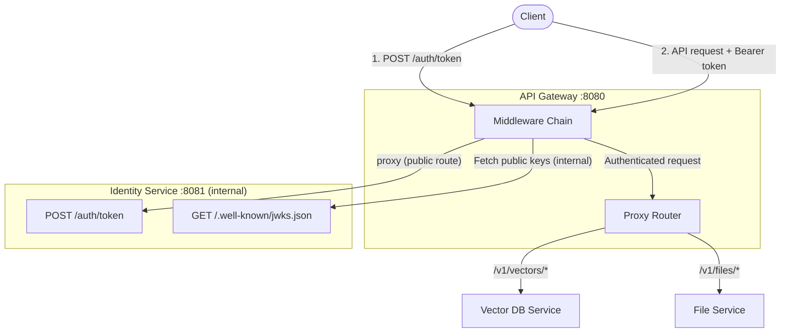
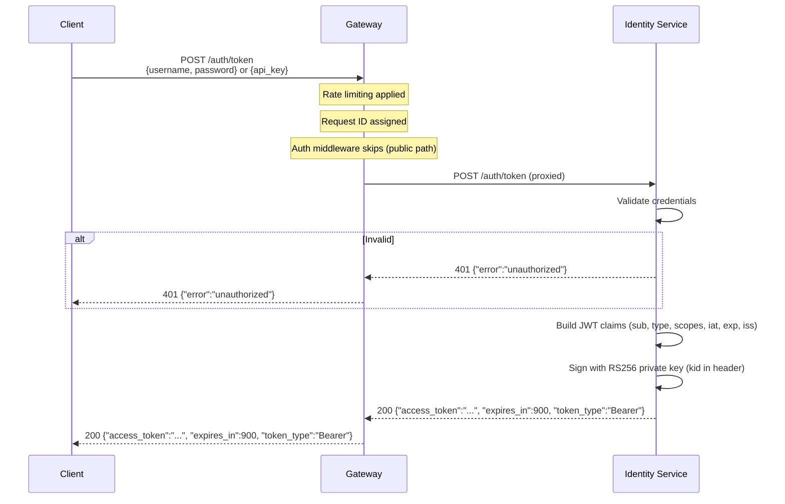
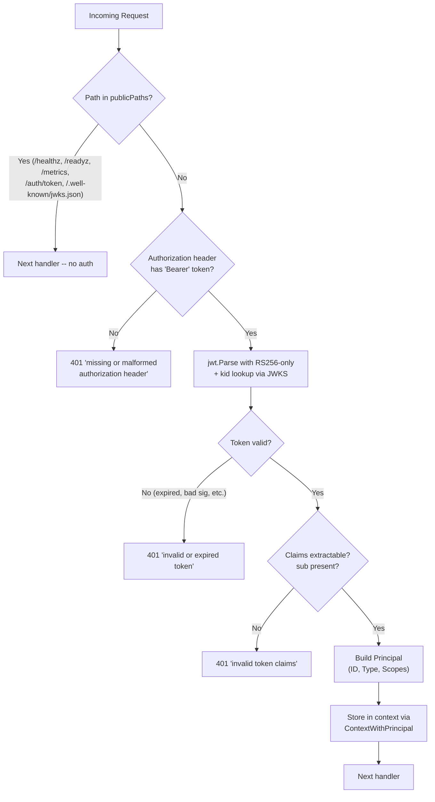
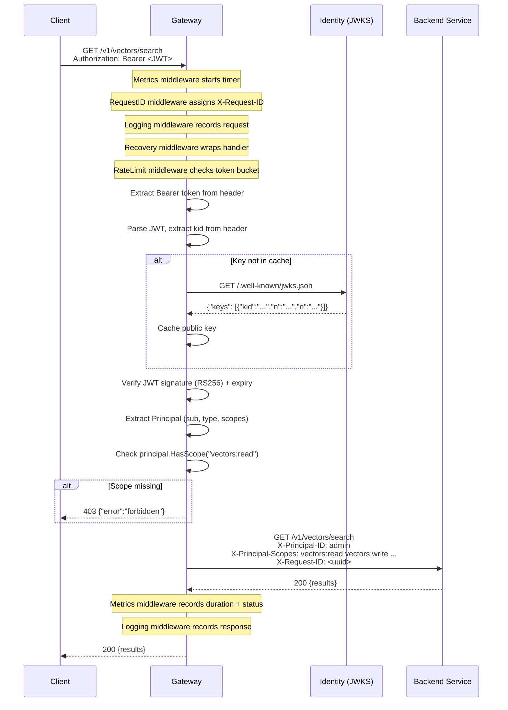

# Authentication Flow

This document describes the gateway's authentication and authorization lifecycle, from token issuance through to proxied backend calls.

## System Overview



All client traffic flows through the gateway, including token issuance. The identity service is an internal service that should not be directly exposed to clients in production.

## 1. Token Issuance

The Identity Service (`cmd/mockidentity/main.go`) issues JWTs via `POST /auth/token`. Clients reach this endpoint through the gateway, which proxies the request to the identity service as a public route (no JWT required, but rate-limited and logged).

### Startup

At startup the service generates an RSA-2048 key pair and assigns a `kid` of the form `mock-key-<unix-timestamp>` (`cmd/mockidentity/main.go:30-35`).

### Request

The client sends a JSON body with **either** username/password or an API key:

```json
{ "username": "admin", "password": "admin" }
```

or

```json
{ "api_key": "test-api-key-1" }
```

### Authentication Logic

| Credential type | Lookup | Principal type | Reference |
|---|---|---|---|
| `api_key` | `apiKeys` map | `domain.PrincipalService` ("service") | `cmd/mockidentity/main.go:93-100` |
| `username` + `password` | `users` map | `domain.PrincipalUser` ("user") | `cmd/mockidentity/main.go:101-108` |

If neither field is provided, or the credentials are invalid, the service returns a `400` or `401` JSON error (`domain.ErrorResponse`).

### JWT Construction

All mock principals receive the full scope set. The token is built as follows (`cmd/mockidentity/main.go:115-131`):

| Claim | Value |
|---|---|
| `sub` | Principal ID (username or service-account ID) |
| `type` | `"user"` or `"service"` |
| `scopes` | `"vectors:read vectors:write files:read files:write"` |
| `iat` | Current Unix timestamp |
| `exp` | `iat` + 15 minutes |
| `iss` | `"mock-identity"` |

The token is signed with **RS256** using the private key. The `kid` is set in the JWT header so consumers can look up the matching public key.

### Response

```json
{
  "access_token": "<signed JWT>",
  "expires_in": 900,
  "token_type": "Bearer"
}
```

Defined by `domain.TokenPair` (`internal/domain/token.go:4-9`).

### Token Issuance Sequence



## 2. JWKS Distribution

The Identity Service exposes its public key at `GET /.well-known/jwks.json` (`cmd/mockidentity/main.go:59-75`). The response follows the standard JWKS format:

```json
{
  "keys": [{
    "kty": "RSA",
    "alg": "RS256",
    "use": "sig",
    "kid": "mock-key-<timestamp>",
    "n": "<base64url-encoded modulus>",
    "e": "<base64url-encoded exponent>"
  }]
}
```

Clients can fetch the JWKS through the gateway at `GET /.well-known/jwks.json` (public route, no auth required). The gateway's own JWKS client still fetches keys directly from the identity service via the configured `JWKS_ENDPOINT` (internal service-to-service call).

### JWKS Client

The gateway fetches and caches these keys via `jwks.Client` (`internal/gateway/adapter/jwks/client.go`).

**Key behaviour:**

1. **Cache hit** -- `GetKey` reads from a `map[string]*rsa.PublicKey` under an `RLock` (`client.go:43-48`).
2. **Cache miss** -- triggers `refresh()`, which upgrades to a write lock and double-checks the `minRefresh` interval (5 minutes) to prevent thundering-herd refreshes (`client.go:64-71`).
3. **Fetch** -- HTTP GET to the JWKS endpoint with a 10-second timeout. Only keys with `kty=RSA` and `alg=RS256` are accepted (`client.go:94-97`).
4. **Post-refresh miss** -- if the `kid` is still not found after a fresh fetch, an error is returned (`client.go:58-60`).

This pattern supports key rotation: when the Identity Service restarts with a new key pair, the first request bearing the new `kid` triggers a cache refresh.

## 3. Middleware Chain

The gateway assembles its middleware in `cmd/gateway/main.go`:

```go
middleware.Chain(
    router,                                          // innermost: proxy router
    middleware.Metrics(metrics),                      // 1. outermost
    middleware.RequestID,                             // 2.
    middleware.Logging(logger),                       // 3.
    middleware.Recovery,                              // 4.
    middleware.RateLimit(rl, metrics),                // 5.
    middleware.Auth(jwksClient, publicPaths, metrics), // 6. innermost middleware
)
```

`Chain` iterates the middleware slice in **reverse** (`internal/gateway/middleware/chain.go:10`), so the **first listed middleware is the outermost wrapper**. A request flows through them in this order:

```
Client request
  -> Metrics        (start timer, record status on response)
    -> RequestID    (generate/propagate X-Request-ID)
      -> Logging    (structured request/response log)
        -> Recovery (catch panics, return 500)
          -> RateLimit (per-IP token bucket)
            -> Auth    (JWT validation)
              -> Router (scope check + reverse proxy)
```

Rate limiting runs **before** authentication so that unauthenticated flood traffic is rejected early without spending time on JWT validation.

### Public Paths

The following paths bypass JWT authentication:

| Path | Purpose |
|---|---|
| `/healthz` | Health check |
| `/readyz` | Readiness check |
| `/metrics` | Prometheus metrics |
| `/auth/token` | Token issuance (proxied to identity service) |
| `/.well-known/jwks.json` | JWKS endpoint (proxied to identity service) |

Public paths still pass through rate limiting, request ID assignment, logging, and recovery middleware. Only JWT validation is skipped.

## 4. Auth Middleware

`internal/gateway/middleware/auth.go` -- the core JWT validation step.

### Decision Tree



### Step-by-step

1. **Public path bypass** -- paths `/healthz`, `/readyz`, `/metrics`, `/auth/token`, and `/.well-known/jwks.json` skip authentication entirely (`auth.go:28-31`).

2. **Extract Bearer token** -- parses the `Authorization` header. Rejects if missing, not prefixed with `Bearer`, or empty after the prefix (`auth.go:96-106`).

3. **Parse and validate JWT** -- uses `jwt.Parse` with two constraints (`auth.go:44-57`):
   - **Algorithm restriction**: `jwt.WithValidMethods([]string{"RS256"})` -- prevents algorithm confusion attacks (e.g. an attacker switching to `HS256` and signing with the public key).
   - **Key lookup**: extracts `kid` from the JWT header and calls `jwks.GetKey(ctx, kid)` to fetch the corresponding RSA public key.
   - **Clock skew leeway**: `jwt.WithLeeway(30 * time.Second)` -- tolerates up to 30 seconds of clock drift between the Identity Service and the Gateway (`auth.go:18`).

4. **Extract Principal** -- maps JWT claims to `domain.Principal` (`auth.go:108-136`):
   - `sub` claim -> `Principal.ID` (required, must be non-empty)
   - `type` claim -> `Principal.Type` (`"service"` maps to `PrincipalService`, everything else defaults to `PrincipalUser`)
   - `scopes` claim -> `Principal.Scopes` (space-delimited string split into `[]domain.Scope`)

5. **Store in context** -- `gw.ContextWithPrincipal(r.Context(), principal)` injects the principal into the request context (`auth.go:90`), making it available to downstream handlers.

## 5. Scope-Based Authorization

After authentication, the proxy router performs scope checks before forwarding to backends (`internal/gateway/adapter/proxy/proxy.go`).

### Route Definitions

| Path prefix | Backend | Read scope | Write scope |
|---|---|---|---|
| `/v1/vectors` | Vector DB Service | `vectors:read` | `vectors:write` |
| `/v1/files` | File Service | `files:read` | `files:write` |

Public proxy routes (`/auth/token`, `/.well-known/jwks.json`) are handled by `makePublicHandler` and do not perform scope checks.

### Scope Resolution

The required scope depends on the HTTP method:

| Methods | Classification |
|---|---|
| `GET`, `HEAD`, `OPTIONS` | **Read** |
| `POST`, `PUT`, `PATCH`, `DELETE` | **Write** |

`principal.HasScope(requiredScope)` checks the principal's scope list using `slices.Contains` (`internal/domain/principal.go:35-37`). If the scope is missing, the gateway returns `403 Forbidden` with `{"error":"forbidden","message":"insufficient permissions"}`.

### Header Rewriting

Before proxying to the backend, the reverse proxy director:

1. **Strips** the `Authorization` header -- backends do not validate JWTs themselves.
2. **Injects** `X-Principal-ID` with the authenticated principal's ID.
3. **Injects** `X-Principal-Scopes` with the space-joined scope list.
4. **Propagates** `X-Request-ID` from the request context (set by the RequestID middleware).

Public route handlers only propagate `X-Request-ID` (no principal injection, since there is no authenticated principal).

This means backends receive pre-validated identity information and can make authorization decisions based on the principal headers without needing access to the signing keys.

## Full Request Lifecycle



## Key Source Files

| File | Purpose |
|---|---|
| `cmd/mockidentity/main.go` | Token issuance (`POST /auth/token`) and JWKS endpoint (`GET /.well-known/jwks.json`) |
| `cmd/gateway/main.go` | Middleware chain assembly, public paths configuration |
| `internal/gateway/middleware/auth.go` | JWT validation, Bearer extraction, Principal extraction |
| `internal/gateway/middleware/chain.go` | `Chain` function and `Middleware` type definition |
| `internal/gateway/middleware/ratelimit.go` | Per-IP rate limiting (runs before auth) |
| `internal/gateway/adapter/jwks/client.go` | JWKS key fetching with cache and double-check lock |
| `internal/gateway/adapter/proxy/proxy.go` | Scope check, public route proxy, header rewriting, reverse proxy to backends |
| `internal/gateway/ports.go` | `JWKSProvider` interface, context helpers (`ContextWithPrincipal`, `PrincipalFromContext`) |
| `internal/domain/principal.go` | `Principal` type, `HasScope`, `PrincipalType` enum |
| `internal/domain/token.go` | `TokenPair` and `TokenClaims` structs |
| `internal/domain/errors.go` | Sentinel errors (`ErrInvalidToken`, `ErrUnauthorized`, etc.) |
| `internal/platform/config/config.go` | Configuration including `IdentityURL` for proxy target |

## Security Notes

- **Gateway as single entry point**: All client traffic, including token issuance, flows through the gateway. The identity service should not be directly exposed to clients in production. This ensures consistent rate limiting, logging, and observability for auth requests.
- **Rate limiting protects auth endpoint**: The gateway's per-IP rate limiter applies to `/auth/token` requests, mitigating brute-force credential stuffing and DDoS attacks on the token issuance endpoint. A dedicated, stricter rate limiter for auth endpoints (e.g. 5 req/min per IP) is recommended as a next step.
- **Algorithm pinning**: The auth middleware only accepts RS256, preventing algorithm confusion attacks where an attacker might attempt to use HS256 with the public key as the HMAC secret.
- **Key ID enforcement**: Every JWT must carry a `kid` header. Tokens without it are rejected before signature verification.
- **Clock skew tolerance**: A 30-second leeway accommodates minor clock drift between services without opening a large window for expired-token abuse.
- **Header stripping**: The `Authorization` header is removed before forwarding to backends, ensuring that leaked or replayed tokens at the backend layer have no effect.
- **Rate limiting before auth**: Unauthenticated flood traffic is rejected at the rate limit layer, avoiding the cost of RSA signature verification on abusive requests.
